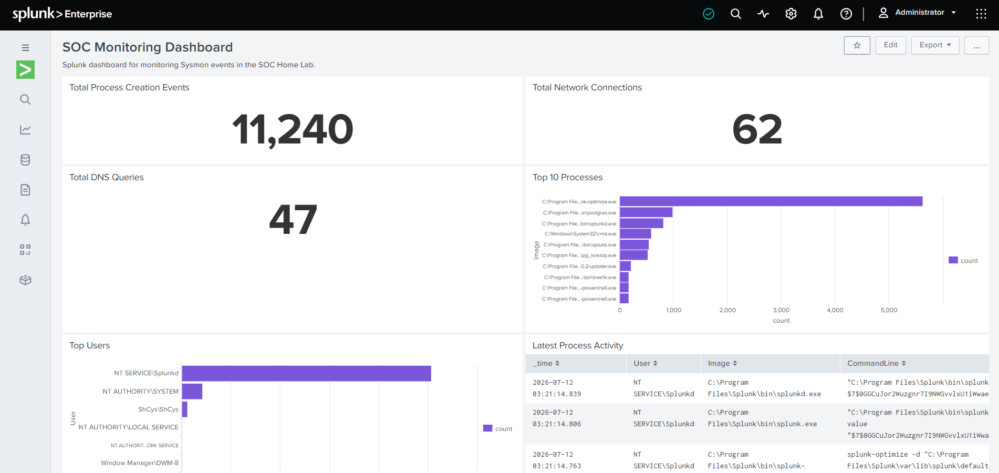

# SOC Home Lab with Splunk

## Project Preview



## Overview

This project documents the process of building a Security Operations Center (SOC) Home Lab using Splunk Enterprise, Sysmon, and Splunk Universal Forwarder.
The goal of this project was to understand how security events are generated, collected, forwarded, analyzed, and visualized using a Security Information and Event Management (SIEM) solution.
Throughout this project, I built the lab from scratch, verified log collection, resolved integration issues, analyzed Sysmon events using SPL, investigated Windows process activity, created a monitoring dashboard, and configured a basic detection and alert.


## Objectives

- Build a basic SOC Home Lab.
- Collect Windows security telemetry using Sysmon.
- Forward logs to Splunk Enterprise.
- Verify data ingestion.
- Analyze security events using SPL.
- Investigate Windows process activity.
- Create a SOC monitoring dashboard
- Create a basic detection for rare process activity.
- Configure Splunk alerting.
- Document the complete implementation process.


## Lab Architecture

```text
+----------------------+
|      Windows         |
| (User Activities)    |
+----------+-----------+
           |
           v
+----------------------+
|       Sysmon         |
| Security Telemetry   |
+----------+-----------+
           |
           v
+----------------------+
| Splunk Universal     |
|     Forwarder        |
+----------+-----------+
           |
           v
+----------------------+
|  Splunk Enterprise   |
| Indexing & Storage   |
+----------+-----------+
           |
           v
+----------------------+
|     SPL Queries      |
| Investigation        |
+----------+-----------+
           |
           v
+----------------------+
|  SOC Dashboard       |
| Monitoring & Analysis|
+----------------------+
           |
           v
+----------------------+
| Detection & Alerting |
+----------------------+
```


## Project Workflow

```text
Windows Activity
        │
        ▼
     Sysmon
        │
        ▼
Universal Forwarder
        │
        ▼
Splunk Enterprise
        │
        ▼
SPL Investigation
        │
        ▼
SOC Dashboard
        │
        ▼
Detection & Alerting
```


## Project Scope

This project focuses on building a functional SOC Home Lab capable of collecting, forwarding, analyzing, monitoring, and detecting Windows security events using Splunk while documenting each implementation phase.


## Project Timeline

| Day | Topic |
|-----|-------------------------------|
| Day 01 | Environment Setup |
| Day 02 | Event Collection Verification |
| Day 03 | Universal Forwarder Verification |
| Day 04 | Data Ingestion Verification |
| Day 05 | Sysmon Integration & Troubleshooting |
| Day 06 | Exploring Sysmon Events |
| Day 07 | Process Investigation |
| Day 08 | Building a SOC Monitoring Dashboard |
| Day 09 | Detection & Alerting |


## Technologies Used

- Splunk Enterprise
- Splunk Universal Forwarder
- Microsoft Sysmon
- Windows Event Logs
- SPL (Search Processing Language)


## Skills Demonstrated

- Splunk Enterprise
- Splunk Search Processing Language (SPL)
- Microsoft Sysmon
- Splunk Universal Forwarder
- Windows Event Logs
- Dashboard Creation
- Process Investigation
- Detection & Alerting


## Key Learning Outcomes

During this project I learned how:

- Set up and configure Splunk Enterprise.
- Collect Windows logs using Sysmon and Splunk Universal Forwarder.
- Use SPL to search security events.
- Analyze Windows event data using Splunk.
- Create a basic security monitoring dashboard.
- Investigate Windows process activity.
- Identify rare process activity for further investigation.
- Configure a basic Splunk alert.
- Troubleshoot log collection and data ingestion issues.
- Document the project setup and troubleshooting process.


## Repository Structure

```text
SOC-Home-Lab/
│
├── docs/
│   ├── Day-01-Environment-Setup.md
│   ├── Day-02-Event-Collection-Verification.md
│   ├── Day-03-Universal-Forwarder-Verification.md
│   ├── Day-04-Data-Ingestion-Verification.md
│   ├── Day-05-Sysmon-Integration-and-Troubleshooting.md
│   ├── Day-06-Exploring-Sysmon-Events.md
│   ├── Day-07-Process-Investigation.md
│   └── Day-08-Building-SOC-Monitoring-Dashboard.md
│   └── Day-09-Detection-and-Alerting.md
│
├── screenshots/
│   ├── day01/
│   ├── day02/
│   ├── day03/
│   ├── day04/
│   ├── day05/
│   ├── day06/
│   ├── day07/
│   └── day08/
│   └── day09/
│
└── README.md
```


## References

1- Splunk Enterprise Documentation
  https://docs.splunk.com/Documentation/Splunk

2- Splunk Universal Forwarder Documentation
  https://docs.splunk.com/Documentation/Forwarder

3- Microsoft Sysmon Documentation
  https://learn.microsoft.com/en-us/sysinternals/downloads/sysmon

4- Microsoft Sysinternals Suite
  https://learn.microsoft.com/en-us/sysinternals/

5- Windows Event Logging Documentation
  https://learn.microsoft.com/en-us/windows/win32/wes/windows-event-log
