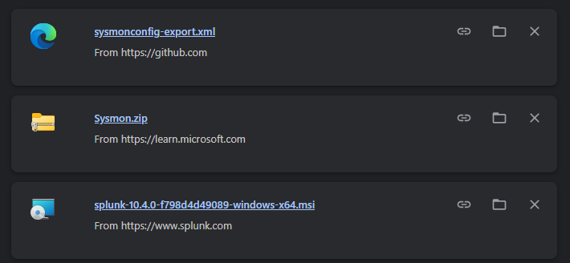
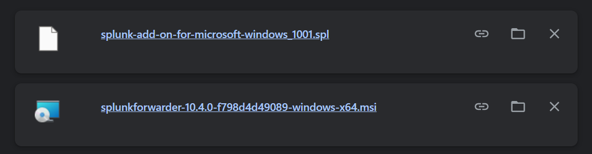
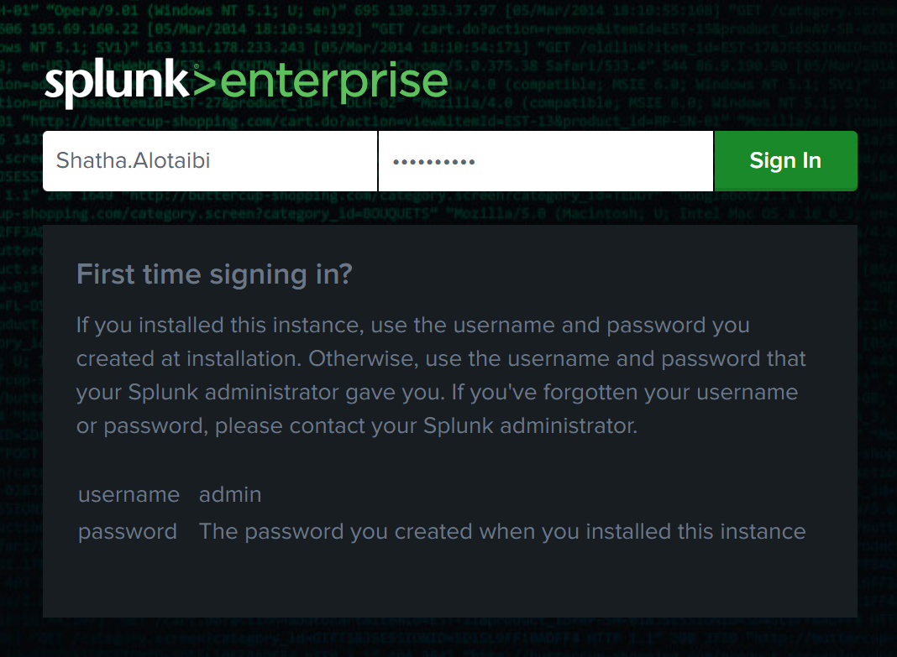
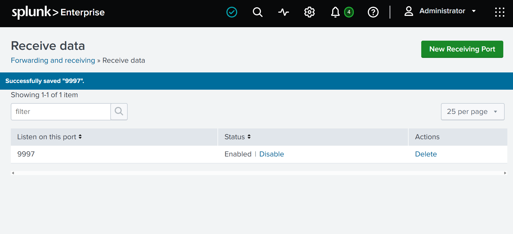

# Day 1 - Environment Setup

## Objective

The objective of Day 1 was to build the foundation of my SOC Home Lab by installing and configuring the core infrastructure required for log collection and security monitoring.

## Lab Environment

| Component | Version |
|-----------|---------|
| Operating System | Windows 11 |
| Splunk Enterprise | 10.4.0 |
| Splunk Universal Forwarder | 10.4.0 |
| Sysmon | Latest Version |

## Completed Tasks

- Installed Splunk Enterprise.
- Installed Splunk Universal Forwarder.
- Downloaded Splunk Add-on for Microsoft Windows.
- Installed Microsoft Sysmon.
- Applied a Sysmon configuration file.
- Enabled TCP Receiving Port (9997) in Splunk Enterprise.
- Configured the Universal Forwarder to send data to Splunk Enterprise.

## Skills Gained

- Splunk Enterprise installation and initial configuration.
- Universal Forwarder deployment.
- Windows event logging fundamentals.
- Basic SIEM architecture.
- Sysmon deployment.

## Challenges

During the initial setup, I experienced several configuration issues while connecting the Universal Forwarder to Splunk Enterprise. I also encountered difficulties with Windows Event Log ingestion. These issues required troubleshooting configuration files, verifying services, and checking connectivity between the forwarder and Splunk.

---

## Lessons Learned

This stage helped me understand how the main components of a SIEM environment work together. I learned the relationship between Splunk Enterprise, Universal Forwarder, Sysmon, and Windows Event Logs, and gained practical experience troubleshooting deployment issues.

## Status

✅ Core SOC Home Lab environment successfully deployed.

Next Goal

Configure Windows Event Log ingestion and verify Sysmon events inside Splunk Enterprise.

## Screenshots

### 1. Splunk Enterprise and Sysmon Download

### 2. Universal Forwarder and Splunk Add-on Download

### 3. Splunk Enterprise Login

### 4. Splunk Receiving Port (9997)

