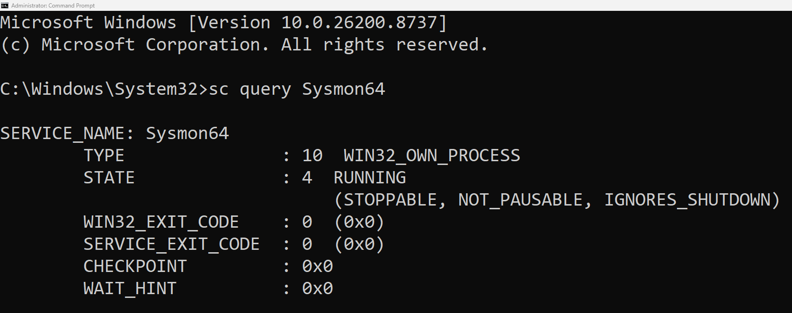
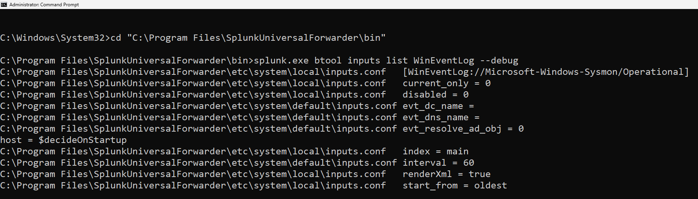
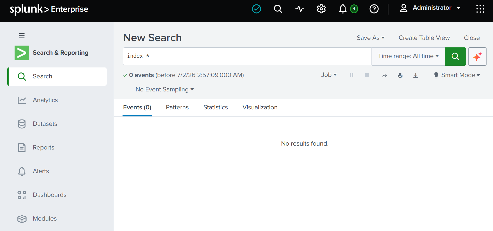
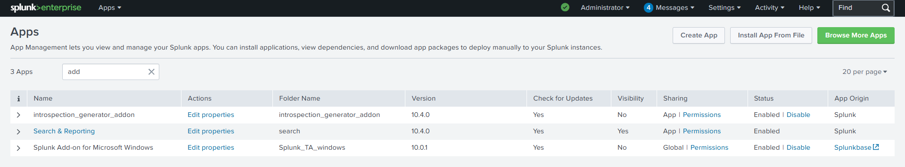

# Day 2 - Event Collection Verification

## Objective

Verify that Sysmon is generating Windows events and confirm that Splunk Universal Forwarder is configured to collect and forward those events to Splunk Enterprise.

## Completed Tasks

- Verified that the Sysmon service is running.
- Confirmed that Sysmon Operational logs are being generated.
- Verified Universal Forwarder WinEventLog configuration.
- Installed Splunk Add-on for Microsoft Windows.
- Searched for incoming events in Splunk Enterprise.
- Identified that Windows events were not yet being indexed.

## Skills Gained

- Verifying Windows services.
- Inspecting Sysmon Operational Event Logs.
- Validating Splunk Universal Forwarder configuration.
- Installing Splunk Add-ons.
- Troubleshooting Windows Event Log ingestion.

## Challenges

Although Sysmon events were successfully generated and the Universal Forwarder configuration appeared correct, no events were indexed inside Splunk Enterprise. Further troubleshooting is required to determine the cause of the ingestion issue.

## Lessons Learned

I learned how to verify each stage of the Windows event collection pipeline instead of assuming the issue was caused by Sysmon itself. I also gained experience validating services, event logs, and Splunk configurations during troubleshooting.

## Status

🟡 In Progress

## Next Step

Investigate why Splunk Enterprise is not indexing Windows events despite the Universal Forwarder and Sysmon being correctly configured.

## Screenshots

### 1. Sysmon Service Running

### 2. Sysmon Operational Events

### 3. Universal Forwarder WinEventLog Configuration

### 4. Splunk Search (No Results)

### 5. Splunk Add-on for Microsoft Windows Installed

