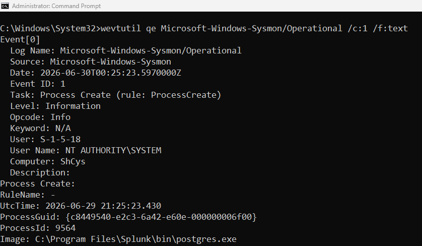

# Day 2 - Event Collection Verification

## Objective

Verify that Sysmon is generating Windows Event Logs and ensure Splunk Universal Forwarder is configured correctly for event collection.

## Completed Tasks

- Verified that the Sysmon service is running.
- Confirmed Sysmon generates Windows Event Logs.
- Verified the Universal Forwarder is monitoring the Sysmon Operational log.
- Installed and enabled Splunk Add-on for Microsoft Windows.
- Tested event searches in Splunk Enterprise.

## Screenshots

### 1. Sysmon Service Running

### 2. Sysmon Events Verification

### 3. Universal Forwarder Input Configuration

### 4. Splunk Search Results

### 5. Splunk Add-on for Microsoft Windows

## Results

- ✅ Sysmon service is running correctly.
- ✅ Windows Event Logs are being generated.
- ✅ Universal Forwarder configuration is valid.
- ✅ Splunk Add-on for Microsoft Windows is installed.
- ❌ Sysmon events are not yet visible in Splunk Enterprise.

## Skills Learned

- Verifying Windows services.
- Inspecting Windows Event Logs using wevtutil.
- Validating Universal Forwarder configuration using btool.
- Understanding the Windows log collection workflow.
- Basic troubleshooting methodology for log ingestion.

## Challenges

Although Sysmon successfully generates events and the Universal Forwarder is configured correctly, the events are not yet being indexed by Splunk Enterprise. Further investigation is required to identify the cause.

## Status

🟡 In Progress

### Next Step

Investigate the forwarding pipeline between the Universal Forwarder and Splunk Enterprise to successfully ingest Sysmon events.
