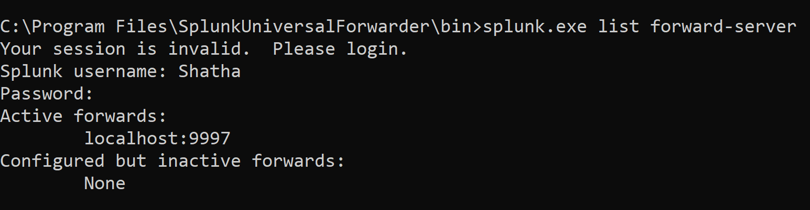
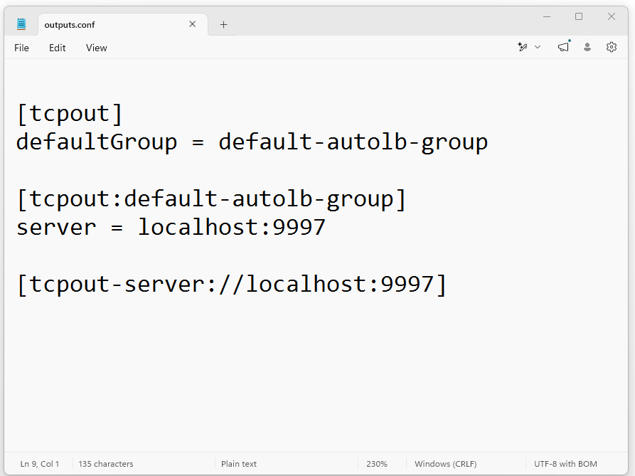
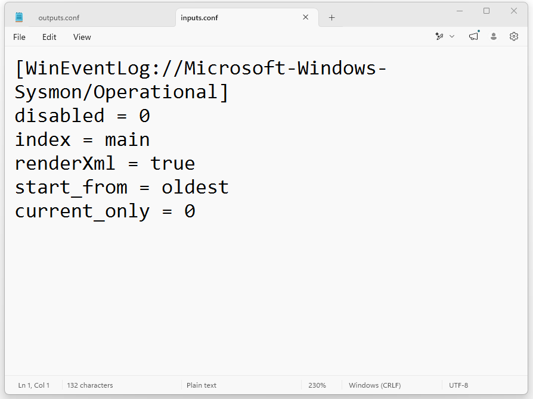
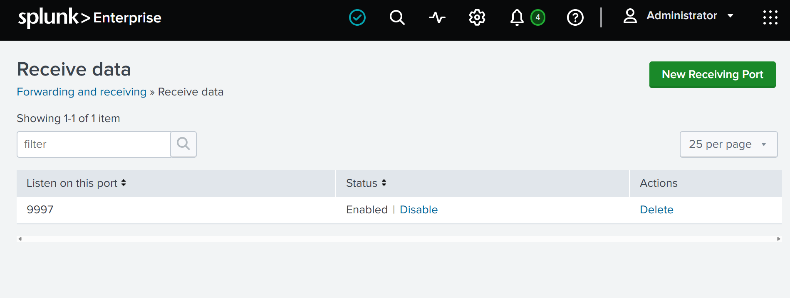

# Day 3 – Universal Forwarder Verification

## Objective

Verify that the Splunk Universal Forwarder is correctly configured and connected to Splunk Enterprise before validating log ingestion.

## Completed Tasks

- Verified the Universal Forwarder connection using the splunk.exe list forward-server command.
- Confirmed that the Universal Forwarder is forwarding data to localhost:9997.
- Reviewed the outputs.conf configuration.
- Reviewed the inputs.conf configuration for Sysmon Operational logs.
- Verified that Splunk Enterprise is listening on TCP port 9997.

## Skills Gained

- Universal Forwarder verification.
- Understanding outputs.conf.
- Understanding inputs.conf.
- Splunk receiving port validation.
- Forwarder troubleshooting.

## Challenges

During this stage, I carefully verified each forwarding component to ensure there were no configuration issues. Instead of assuming the connection was working, I validated the forwarding server, configuration files, and receiving port before moving to log ingestion.

## Lessons Learned

This stage helped me understand how to verify the complete log forwarding pipeline. I learned that checking the Universal Forwarder status, configuration files, and receiving port is essential before troubleshooting missing events in Splunk.

## Status

✅ Universal Forwarder successfully connected to Splunk Enterprise.

### Next Goal

Verify that Sysmon events are successfully ingested and searchable in Splunk Enterprise.

# Screenshots

### 1. Verify Universal Forwarder Connection

Verified that the Universal Forwarder is actively forwarding data to Splunk Enterprise on localhost:9997.

### 2. outputs.conf Configuration

Verified the forwarding configuration in the outputs.conf file.

### 3. inputs.conf Configuration

Verified the Sysmon Operational Event Log configuration in the inputs.conf file.

### 4. Splunk Receiving Port (9997)

Confirmed that Splunk Enterprise is actively listening on TCP port 9997 to receive forwarded events.
