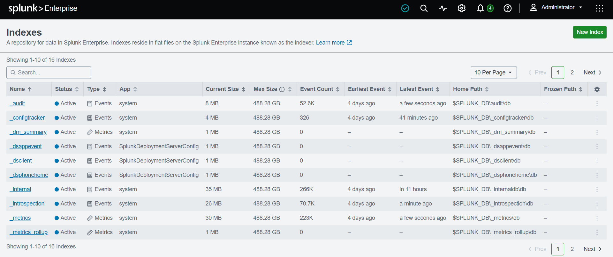
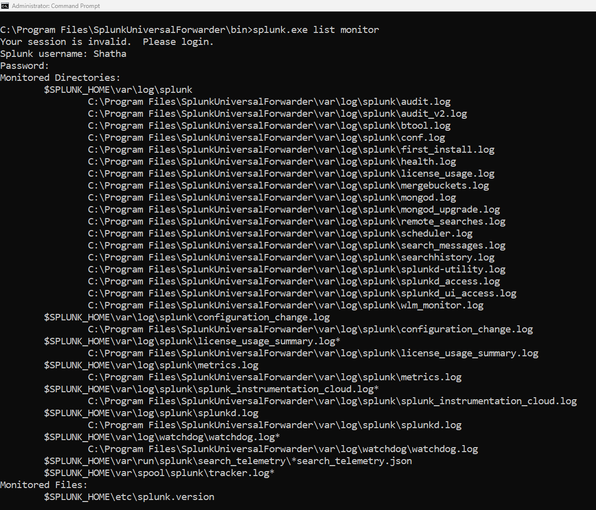
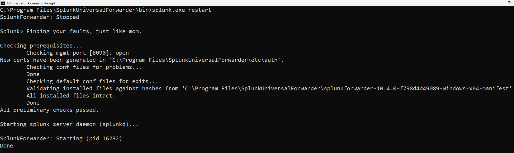
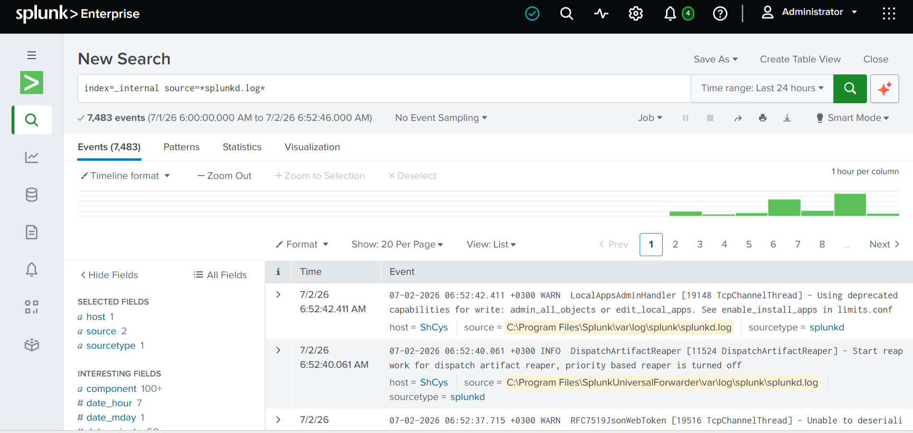
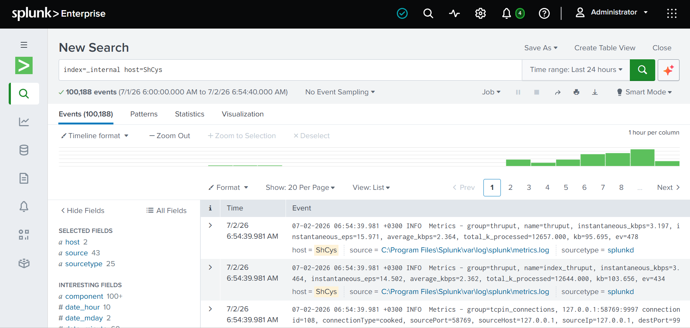

# Day 4 – Data Ingestion Verification

## Objective

Verify that Splunk Enterprise is successfully receiving and indexing data from the Splunk Universal Forwarder.

## Completed Tasks

- Verified that Splunk Enterprise was running correctly.
- Restarted Splunk Enterprise to apply configuration changes.
- Verified that the _internal index was receiving events.
- Confirmed that the Universal Forwarder was sending data successfully.
- Verified that the host ShCys was successfully indexed in Splunk.

## Challenges

Initially, no events appeared during searches, making it difficult to determine whether the issue was related to the Universal Forwarder or Splunk Enterprise. After restarting Splunk and validating the _internal index, I confirmed that the forwarding pipeline was functioning correctly.

## Lessons Learned

I learned that successfully configuring a Universal Forwarder does not necessarily guarantee immediate visibility of events. Verifying internal Splunk logs is an effective way to confirm that data is being received and indexed correctly before troubleshooting search queries.

# Screenshots

### 1. Splunk Indexes Verification

### 2. Universal Forwarder Monitoring

### 3. Splunk Enterprise Restart

### 4. Internal Log Verification

### 5. Host Verification

