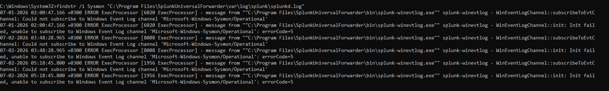
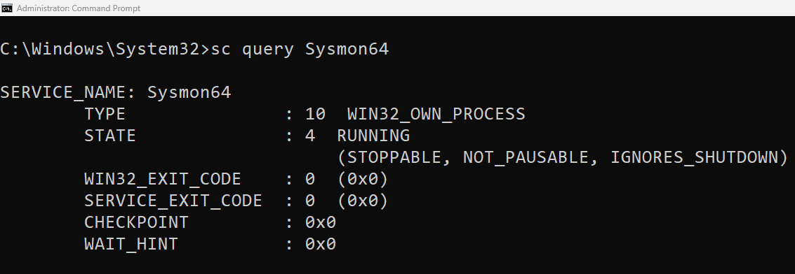
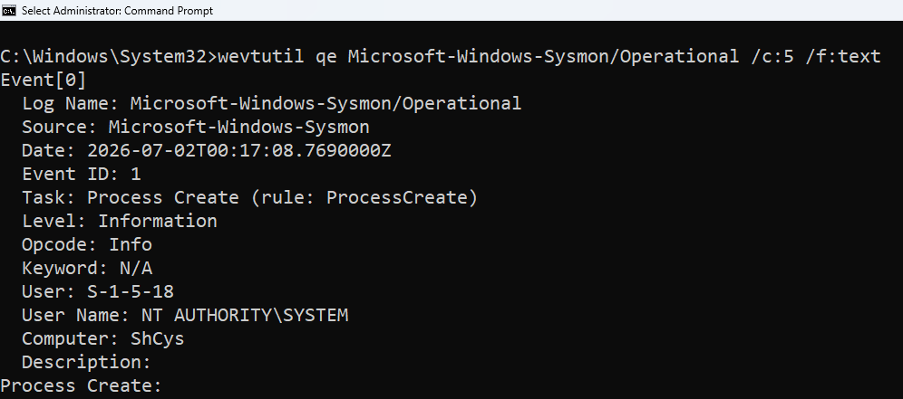
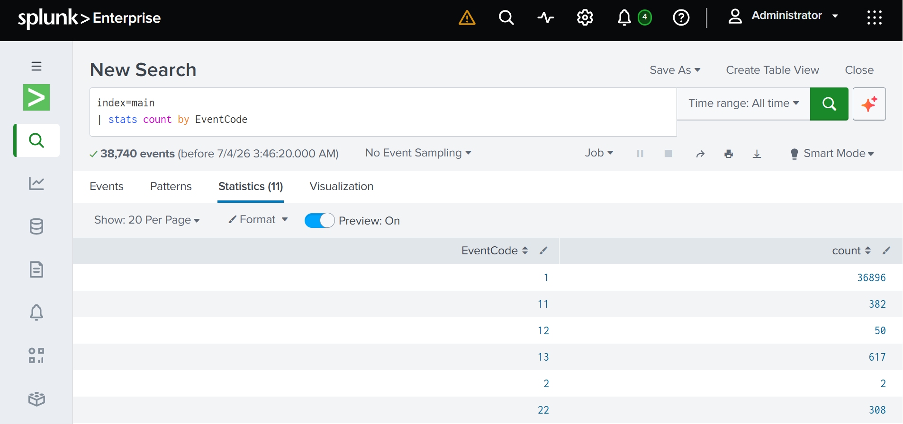
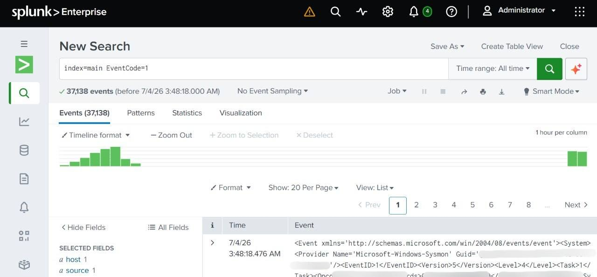

# Day 5 – Sysmon Integration & Troubleshooting

## Objective

Verify that Sysmon events are successfully collected and indexed in Splunk Enterprise.

## Problem

After configuring Sysmon and the Splunk Universal Forwarder, Sysmon events were not appearing in Splunk.

The following error was identified:
Could not subscribe to Windows Event Log channel
Microsoft-Windows-Sysmon/Operational
errorCode=5

## Investigation

The following checks were performed:

- Verified that the Sysmon service was running.
- Confirmed that the Sysmon Operational event channel existed.
- Reviewed the Universal Forwarder log.
- Verified that Sysmon events were successfully indexed in Splunk.

## Resolution

The issue was resolved, and Sysmon Operational events were successfully collected and indexed in Splunk.

## Lessons Learned

- Verified that Sysmon generated Windows Event Logs successfully.
- Confirmed that Sysmon events were indexed in Splunk.
- Used SPL searches to validate successful event collection.

## Screenshots 

### Error Found

### Sysmon Service Running

### Sysmon Event Channel

### Event Statistics

### Process Creation Events

