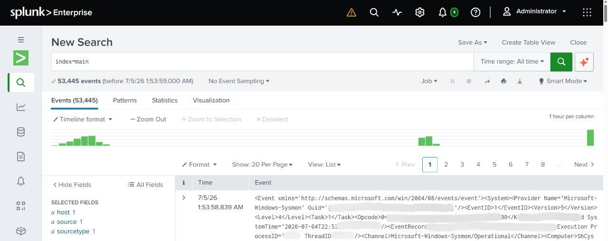
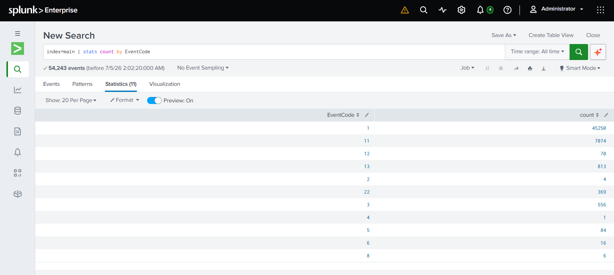
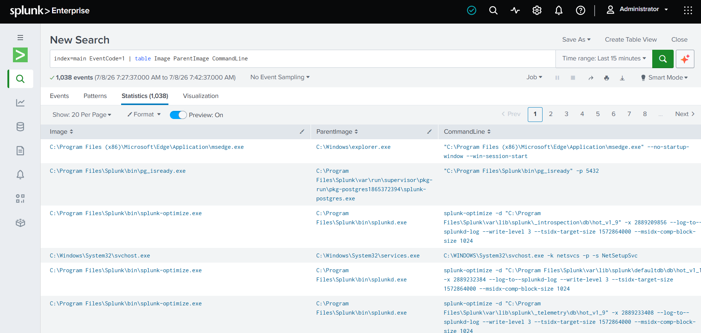
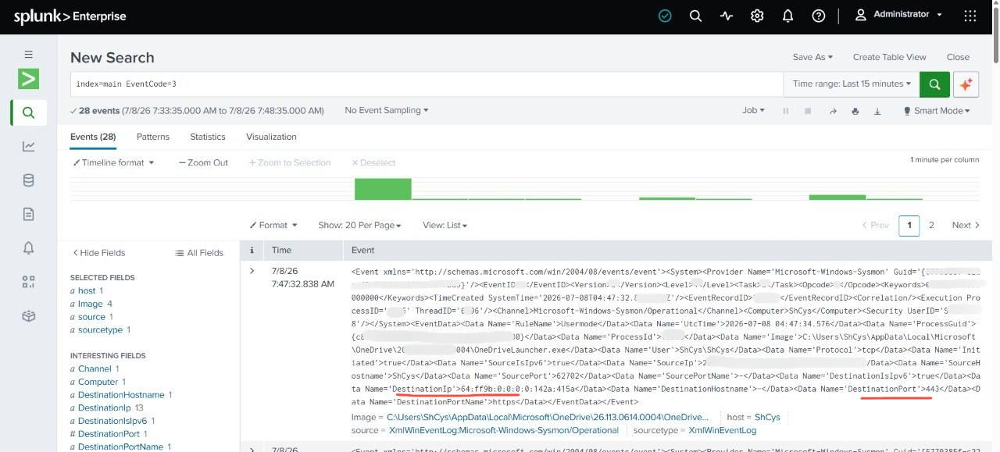
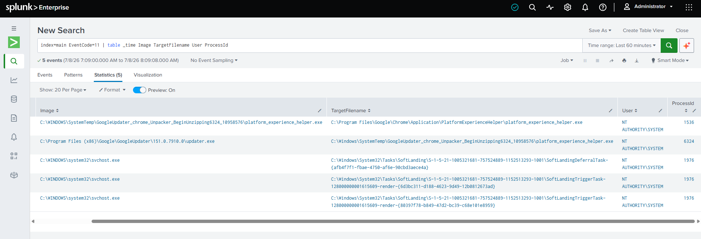
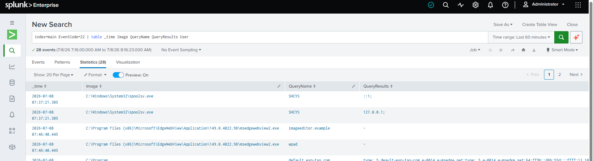

# Day 06 – Exploring Sysmon Events with Splunk

## Objective

Practice using SPL (Search Processing Language) to investigate different Sysmon events collected by Splunk.

## 1. Display All Indexed Events

SPL Query
index=main

## 2. Count Sysmon Event IDs

SPL Query
index=main | stats count by EventCode

## 3. Process Creation (Event ID 1)

SPL Query
index=main EventCode=1

## 4. Network Connections (Event ID 3)

SPL Query
index=main EventCode=3

## 5. File Creation (Event ID 11)

SPL Query
index=main EventCode=11

## 6. DNS Queries (Event ID 22)

SPL Query
index=main EventCode=22

## What I Learned

- Event ID 1 records process creation.
- Event ID 3 records network connections.
- Event ID 11 records file creation.
- Event ID 22 records DNS queries.
- Using SPL queries makes it easier to investigate endpoint activity in Splunk.
