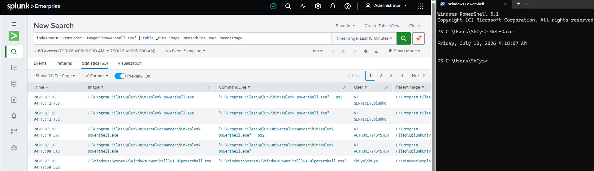
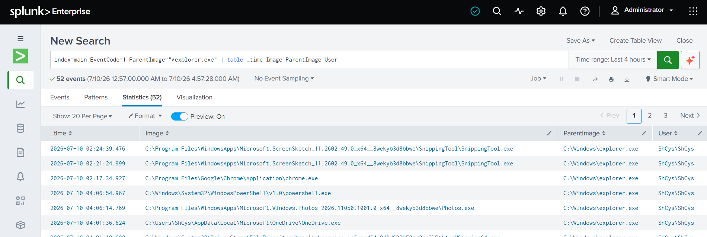
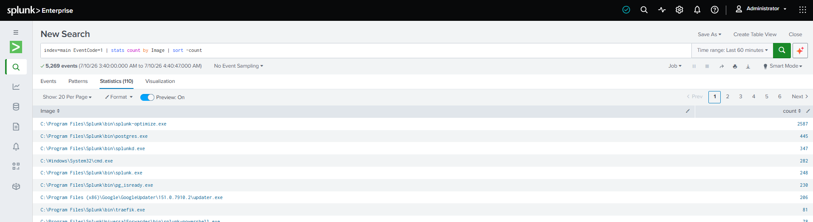
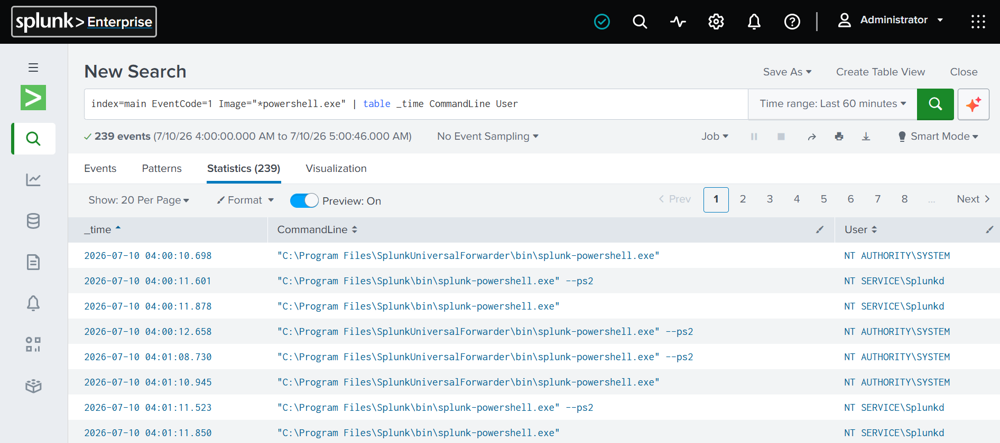
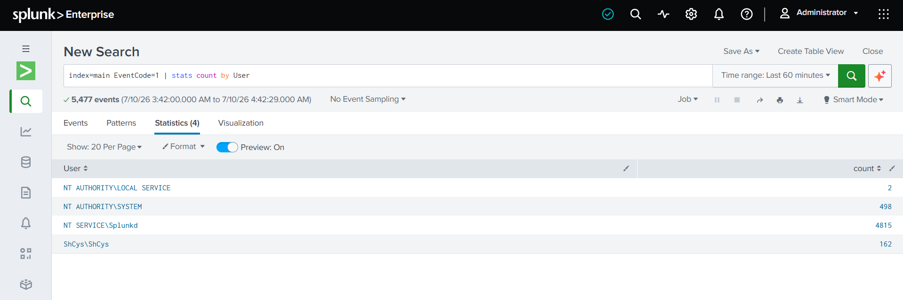

# Day 07 – Investigating Process Activity 

## Overview

On Day 07, I focused on investigating Sysmon Process Creation events (Event ID 1) using Splunk. Instead of simply confirming that events were collected, I analyzed process activity by examining fields such as Image, CommandLine, User, and ParentImage.

This helped me understand how analysts investigate process execution and identify relationships between parent and child processes.

## Objectives

- Investigate PowerShell process execution.
- Analyze Command Prompt activity.
- Understand the Parent Process relationship.
- Identify the most frequently executed processes.
- Review PowerShell command lines.
- Identify users responsible for process execution.

## SPL Searches

### 1. PowerShell Investigation
index=main EventCode=1 Image="*powershell.exe"
| table _time Image CommandLine User ParentImage

### 2. Command Prompt Investigation
index=main EventCode=1 Image="*cmd.exe"
| table _time Image CommandLine User ParentImage

### 3. Parent Explorer Process
index=main EventCode=1 ParentImage="*explorer.exe"
| table _time Image ParentImage User

### 4. Top Executed Processes
index=main EventCode=1
| stats count by Image
| sort -count

### 5. PowerShell Commands
index=main EventCode=1 Image="*powershell.exe"
| table _time CommandLine User

### 6. Users Executing Processes
index=main EventCode=1
| stats count by User

