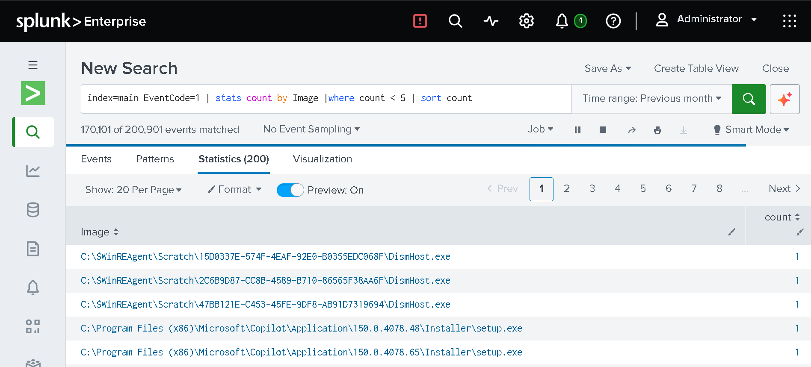
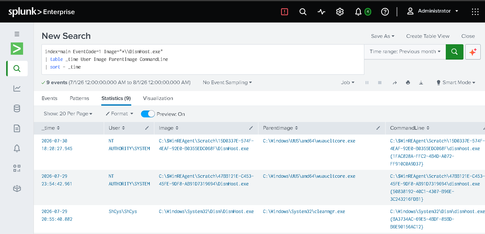

# Day 9 – Detection & Alerting

## Objective

Create a basic detection in Splunk for rare process activity and configure an alert for further SOC investigation.

## 1. Rare Process Detection

Reviewed Sysmon Process Creation events (Event ID 1) and identified processes with low occurrence counts.

### SPL Query

    index=main EventCode=1
    | stats count by Image
    | where count < 5
    | sort - count

This query was used to identify processes that appeared infrequently in the collected logs.

### Screenshot

## 2. Process Investigation

DismHost.exe was identified as a rare process and investigated using Sysmon Process Creation events.

### SPL Query

    index=main EventCode=1 Image="*\\DismHost.exe"
    | table _time User Image ParentImage CommandLine
    | sort - _time

The investigation focused on the process timestamp, user, parent process, and command line.

### Screenshot

## 3. Parent Process Analysis

The parent processes associated with DismHost.exe were analyzed to provide additional context.

### SPL Query

    index=main EventCode=1 Image="*\\DismHost.exe"
    | stats count by ParentImage
    | sort - count

Observed parent processes included:

- wuaucltcore.exe
- cleanmgr.exe
- la57setup.exe
- directxdatabaseupdater.exe

### Screenshot

## 4. Parent Process Investigation

The la57setup.exe parent process was investigated further.

### SPL Query

    index=main EventCode=1 ParentImage="*\\la57setup.exe"
    | table _time User Image ParentImage CommandLine
    | sort - _time

The observed relationship was:

la57setup.exe → DismHost.exe

The activity was treated as requiring further investigation rather than being classified as malicious.

### Screenshot

## 5. Alert Configuration

The rare process detection was configured as a Splunk alert using a result-based trigger and a Triggered Alerts action.

### Screenshot

## 6. Alert Verification

The configured alert was verified through Splunk's Triggered Alerts.

### Screenshot

## 7. Alert Creation Demonstration

A short video demonstrates the process of configuring and creating the Splunk alert.

### Video

[Watch Alert Creation Demonstration](../videos/day9/alert-creation.mp4)

## Analysis

Rare process activity can be useful for identifying events that require further investigation. However, a low-frequency process does not automatically indicate malicious activity.

DismHost.exe was investigated by examining its parent processes and available event context. The observed activity did not provide sufficient evidence to confirm malicious behavior.

This demonstrated the importance of combining detection logic with contextual investigation before escalating an event.

## Assessment

| Category | Result |
|---|---|
| Detection | Rare Process Activity |
| Investigation Target | DismHost.exe |
| Observed Relationship | la57setup.exe → DismHost.exe |
| Assessment | Requires Further Investigation |
| Verdict | No confirmed malicious activity |
